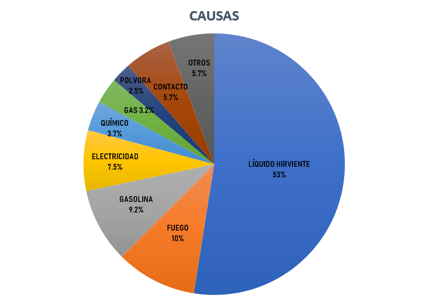

  
 <h1>Semana 1: Problemática</h1>

 

<cite> "Globalmente, las quemaduras son un serio problema de salud pública. Un estimado de 265.000 muertes ocurren cada año sólo por fuegos, con más muertes en líquidos calientes, quemaduras eléctricas y otras formas de quemaduras cuyas estatisticas mundiales no estan disponibles." </cite> 

-Organización Mundial de la Salud.

  

En Latinoamérica, un promedio de 1351 casos de quemaduras requieren hospitalización y alrededor de 23 mueren anualmente. En el Perú, específicamente en el 2013, se hospitalizaron 291 niños en el Instituto Nacional de Salud del Niño (INSN), en el cual 54% de ellos tenia cuatro años y 23 % de cinco a nueve años; el 70% sufrió quemaduras por caída de líquidos calientes sobre su cuerpo y 30% restante tuvo contacto directo con fuego.

  

<b>Figura 1. Causas frecuentes de quemaduras </b>

 
Fuente:http://scielo.isciii.es/scielo.php?script=sci_arttext&pid=S0376-78922017000100009

<h2> ¿Qué son las quemaduras? </h2>
Una quemadura es una lesión a la piel u otro tejido orgánico causada principalmente por el calor o la radiación, la radioactividad, la electricidad, la fricción o el contacto con productos químicos.
  

  

 

  <h2> Impacto socioeconómico </h2>

El riesgo de sufrir quemaduras esta intimamente relacionado con la posición socio-economica. Esto se ve evidenciado no solo en Latinoámerica sino a nivel mundial (Organización Mundial de la Salud).

Los pacientes atendidos provienen en su mayoría de familias calificadas en sus consultorios de origen como indigentes. Por lo tanto, el acceso a la atención de salud está limitada a los recursos existentes en el barrio o la localidad de familias calificadas en sus consultorios de origen como de bajos recursos, ya que no siempre disponen de la atención especializada e integrada dirigida exclusiva al paciente (Pontificia Universidad Católica de Chile).

<h2> Impacto psicológico </h2>
La sociedad actual ve la apariencia física como instrumento básico para alcanzar el éxito social y laboral, y, es reforzado por los medios de comunicación. Sin embargo, muchas veces se confunde imagen corporal con apariencia física, la imagen corporal involucra el sentimiento que cada persona tiene en relación a su propio cuerpo, cualquier alteración en la imagen influye en la autoestima, trayendo como consecuencia un gran impacto psicológico y emocional colocando a la persona en situación de crisis con una alta vulnerabilidad psicológica. (Arredondo, 2016)

<b>Figura 2. Complicaciones de las quemaduras </b>
 
Fuente:https://www.slideshare.net/KwinzyMaikaje/quemaduras-parte-2 
<a href="semana2.html"> 

</a> 
