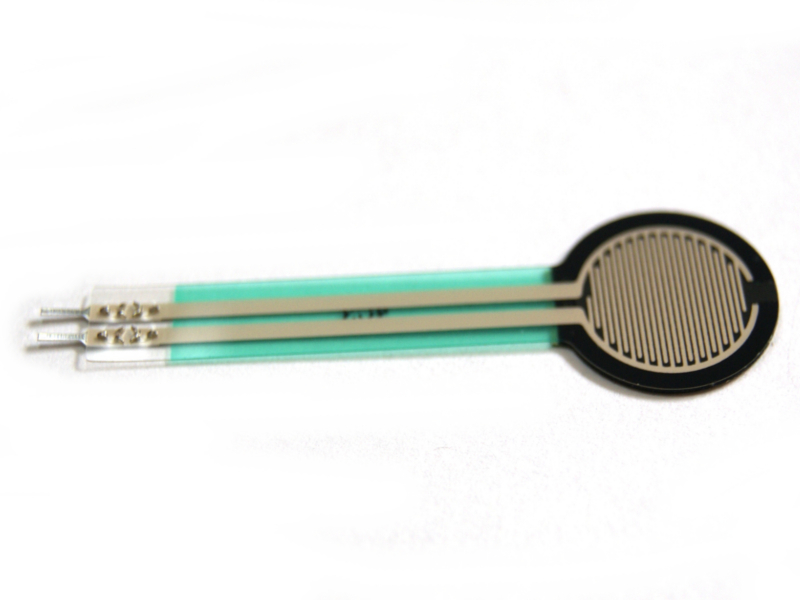
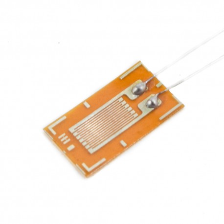

 
A partir de esta semana, se ha avanzado el desarrollo de la parte de programación y de electrónica. Como se había establecido en la semana anterior, el circuito integrado de los sensores iban a establecerse como módulos secundarios.

<h2>Proceso de realización de módulos secundarios</h2>
  

 
1. Para comenzar, escogimos el sensor de presión MF01 como sensor analógico de nuestro dispositivo. Luego de realizar una programación simple en el programa Arduino, concluimos que el sensor no era lo suficientemente sensible para nuestro rango teórico de trabajo que va de 2kPa a 4kPa (Que es equivalente a 15 a 30mmHg respectivamente).
  

 
2. Buscamos alternativas al sensor MF01, encontrando como posible solución el uso de galgas extensiométricas. Se estudió el arreglo del circuito eléctrico Wheatstone Bridge o puente de Wheastone, el cual se utiliza para determinar cambios relativos en la resistencia de una galga extensiometrica.

  

 
3. Se realizaron las conecciones del circuito del puente de Wheatstone en un protoboard, en donde tambien se le acopló un amplificador operacional a745 para aumentar la señal de voltaje que brindaba la variación de resistencia de la galga extensiométrica al arduino.

  

 
4. Se realizó el soldado de tres circuitos integrados de puentes de wheastone + amplificadores operacionales a745. Los componentes utilizados para las pruebas y para todo el circuito fueron:

<h2>Lista de Materiales por cada circuito integrado:</h2>
  

 
- 1 placa de baquelita perforada de 7x5cm. 
- 1 galga extensiométrica de 120ohm de resistencia. 3mm de diamétro 
- 1 amplificador operacional a745 
- 3 resistencias de 120ohm 
- 2 resistencias de 10ohm 
- 2 resistencias de 4,7kohm 
- Cable estañado para protoboard flexible de diversos colores (verde,rojo,azul,blanco,amarillo,negro) 

Además de lo antes mencionado, se utilizaron los siguientes componentes y/o instrumentos:
- Arduino MEGA:  
- Pinzas de cocodrilo: 
- Fuentes reguladoras de voltaje (cada una generando 5 voltios de manera continua): 
- Multimetro: Su función reside en verificar resistencias, conductividad y voltaje. 

Las galgas extensiométricas son más precisas que el sensor de presión MF01 y con un amplificador operaciones a745 se logró obtener una sensibilidad que se encuentra dentro del rango deseado (2 a 4kPa). Se comprobó que la medición de la galga aún funciona en una superficie no lisa y con relieve. Se realizó una extrucción de 3.5mm en el modelo 3D de la máscara con huecos en las zonas antes mencionadas (ojos, boca, nariz) para mandarlo a imprimirlo en FLEX. Se llegó a la conclusión de que el material de la máscara tiene que ser medianamente flexible para que se pueda amoldar a la cara a lo largo del tiempo del proceso de recuperación de la cicatriz, debido a que la quemadura es un proceso dinámico y no estático.
