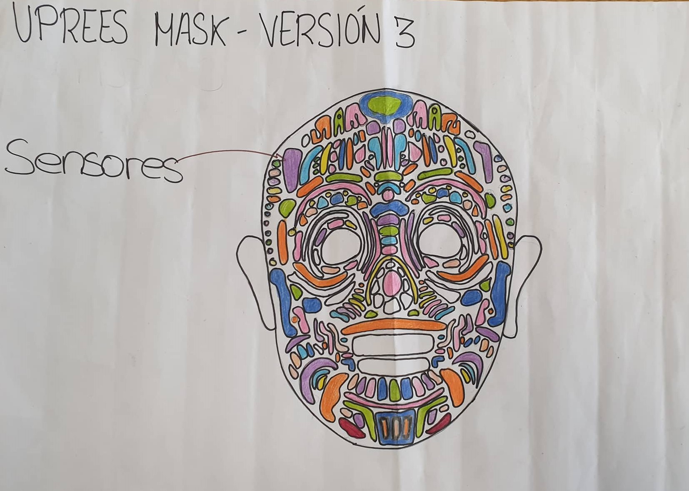

<h2> Boceto 1 </h2>

  

 Máscara de tratamiento para quemados basada en presoterapia usando una doble cámara de contención (aire y agua), regulables con válvula de entrada de aire del ambiente.

<h2> Boceto 2 </h2>

  

Máscara de tratamientos para quemados basada en presoterapia con múltiples sensores que indiquen el progreso del paciente (cicatrización) para establecer una presión más exacta.

<h2> Boceto 3 </h2>

  

Máscara de tratamiento para quemados basada en presoterapia de tres capas: capa siliconada en contacto con la cara, cámara de agua regulable para aplicar la presión y shell mask impresa en 3D a medida.

