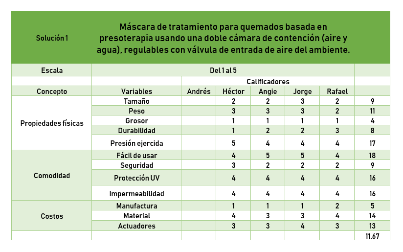
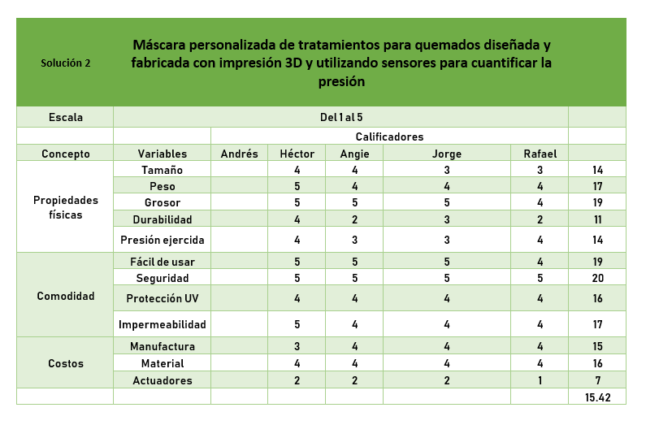
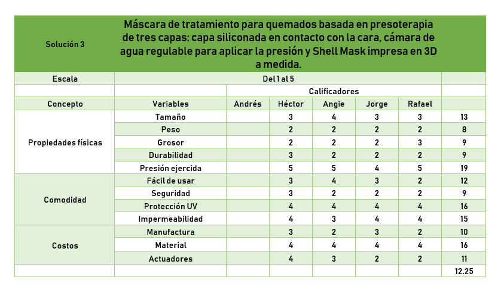

<h1>Diagrama de Gantt </h1>  
 
<iframe src="https://instagantt.com/shared/s/AKP0ekFC4VcoNlREzAVQ/latest" width="1150" height="700"></iframe>

<h1>Plan de Trabajo</h1>  
  
  
<iframe src="https://docs.google.com/spreadsheets/d/e/2PACX-1vRCrRrgpqYmBiuwkfiTDlqcV7c6PMCoq-FCTs3eWeQCNn2P-Qf-QORE6-E013LzVulpMtJTgeMcvpXb/pubhtml?widget=true&headers=false" width="1150" height="710"></iframe>

<h1>TABLAS DE EVALUACIÓN </h1>  

 

 

 

 

 

