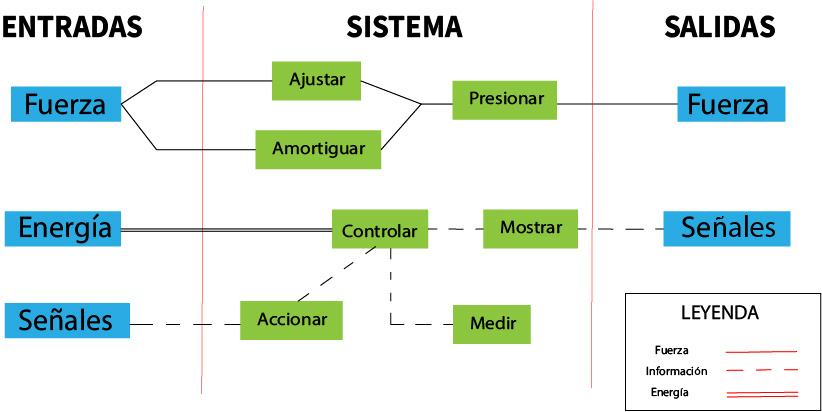

<h2> Entradas y Salidas (Diagrama Modular)</h2>

  

<h1> Matriz Morfológica de la solución escogida </h1>
  
  
<iframe src="https://docs.google.com/spreadsheets/d/e/2PACX-1vRz5Rf7AURngtrsxl_cXOkkxTfjxZ0ZF8tolzPXfaLQVlXPLnpKb_dy4LDTf7q6koU0yAGVl1kjIKmk/pubhtml?widget=true&headers=false" width="1050" height="900"></iframe>

<h2> Lista de Materiales </h2>

Controlador: Arduino Nano. Se escogió este modelo porque tiene que ser lo más pequeño posible para no incomodar al paciente. 
Material Capa Externa: Flex/PLA. El material externo será impreso en 3D. Se probará la resistencia de ambos. 
Material Capa Interna: Silicona Dragon Skin 30/RTV 1530. 
Correas: Tela elástica o velcro. Tienen la función de ajustar la máscara para ejercer la presión adecuada al paciente. 
Sensor de Presión MF01 (2 cantidades): Recogeran información de la presión ejercida por la capa externa. La cantidad puede variar de acuerdo al avance del proyecto. 
Pantalla LCD y Mini Speaker: La pantalla mostrará el valor número de la presión recogida por los sensores y el speaker sonará cuando ya esté en el límite del rango de presion permitido. 
Otra opción es que el speaker suene de manera intermitente cuando este dentro del rango y de manera continua cuando ya este en el límite. 
Interruptor simple para el encendido y apagado del sistema.

 

