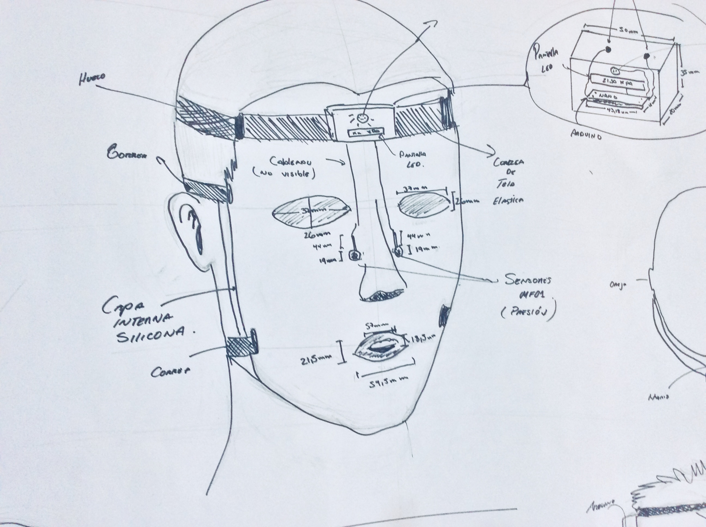
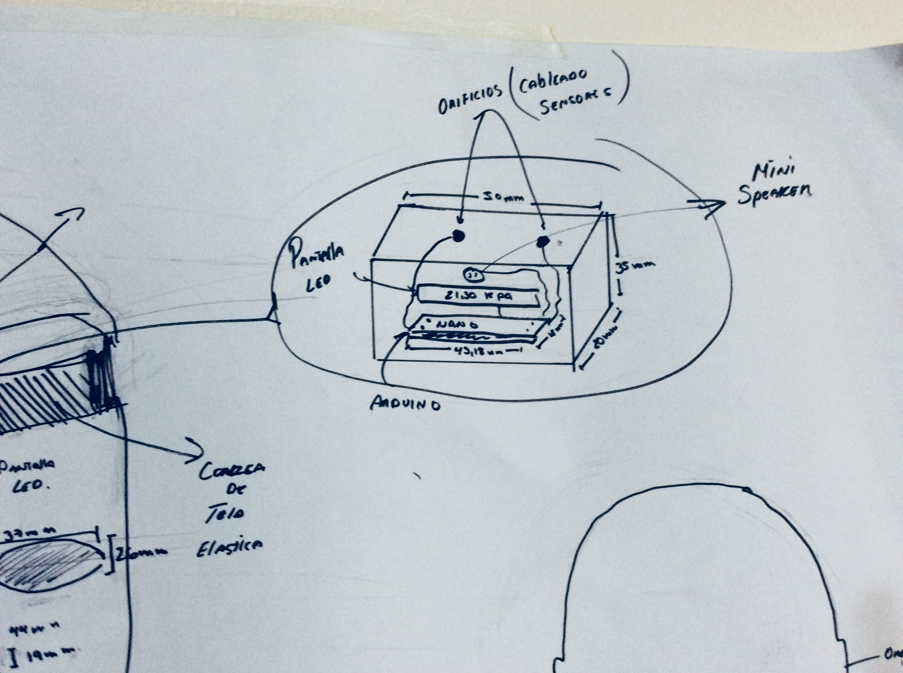
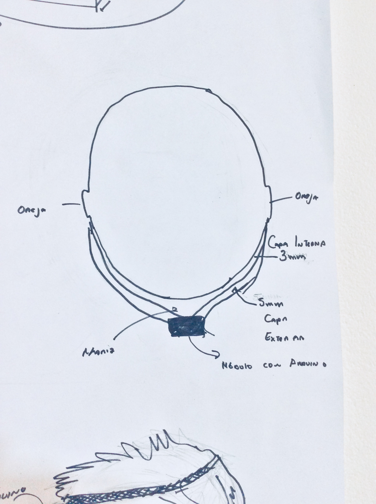
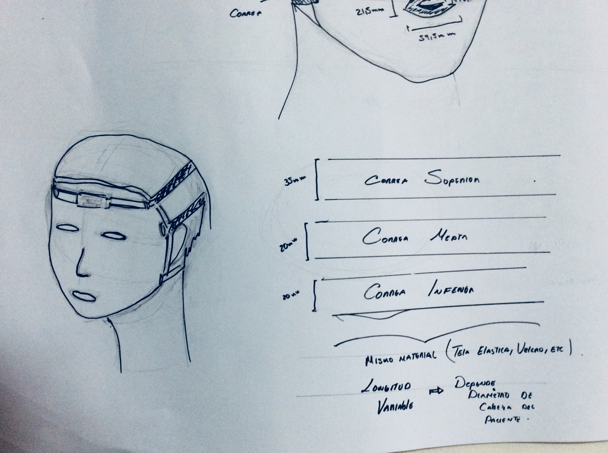
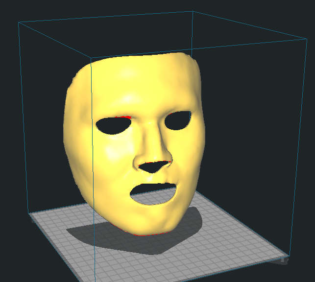
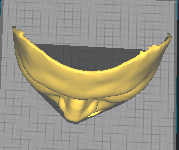
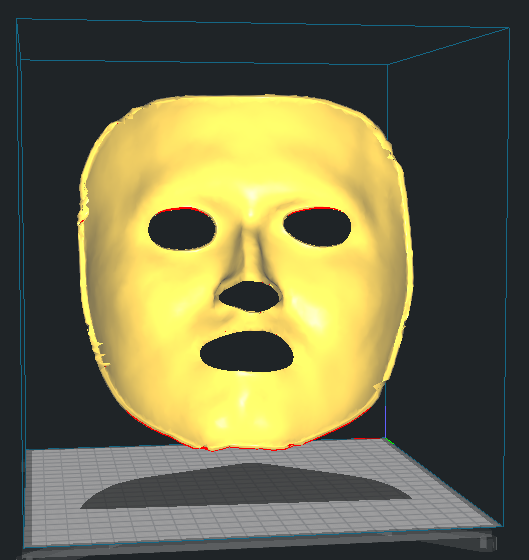
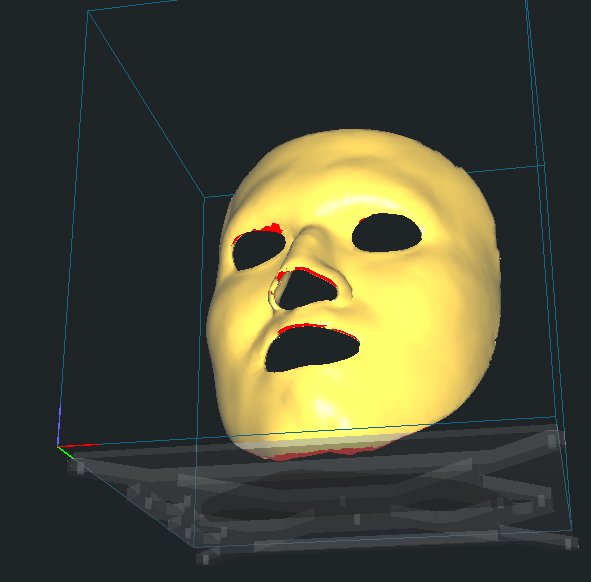

<h2> Boceto Solución Final </h2>
  
Lo mas importante en este boceto son los sensores de presion (MF01).

  

 
  
Con los sensores podemos ver la variacion de presion que ejerceremos y la que deseamos, controlados por el arduino y una pantalla led que nos muestre la variacion de presion.

  

 
  
La mascara constara con 2 capas; la capa interna sera de silicona con 3 mm de ancho, la capa externa de material dragon skin con 5 mm de ancho.

  

 
  
Contara con 3 orificios por ellos iran correas de 35, 20, 20mm respectivamente.

  

 
  
Editar aqui

  

 
  
  

 
  

<h2> Modelado 3D </h2>

   

 
  

 
   

 
  

 

    
<h3>Avance Resumen Ejecutivo en Clase</h3>

ANGIE: Para pacientes quemados que necesitan de la presoterapia. U-press es una máscara que permite hacer presoterapia a diferencia de las máscaras de tela este producto llegaría a zonas difíciles de hacer presión como pasa con las máscaras de tela y tendría sensores que permitan ver que llegue la presión necesaria.

DAIR: Para los pacientes adultos quemados que actualmente no cuentan con un tratamiento de cicatrización adecuado. U-press es una máscara de tratamiento personalizada que, a diferencia de las máscaras de tela actuales, ejerce y cuantifica de forma efectiva la presión en el rostro.

JORGE: Para adultos con quemaduras faciales profundas, que tienen dolor innecesario e incomodidades estéticas. U-press es una máscara que mejora la cicatrización de las quemaduras, a diferencia de los tratamientos convencionales, permite monitorear el proceso de manera cuantificable.

RAFAEL: Para personas con quemaduras faciales que tienen el deseo de no sentir incomodidad en su tratamiento. U-press es una máscara que protege las heridas sin dolor y con un mejor resultado de cicatrización que a diferencia de las máscaras de tela, el producto trae sufrimiento.

<a href="semana6.html"> 

</a> 
